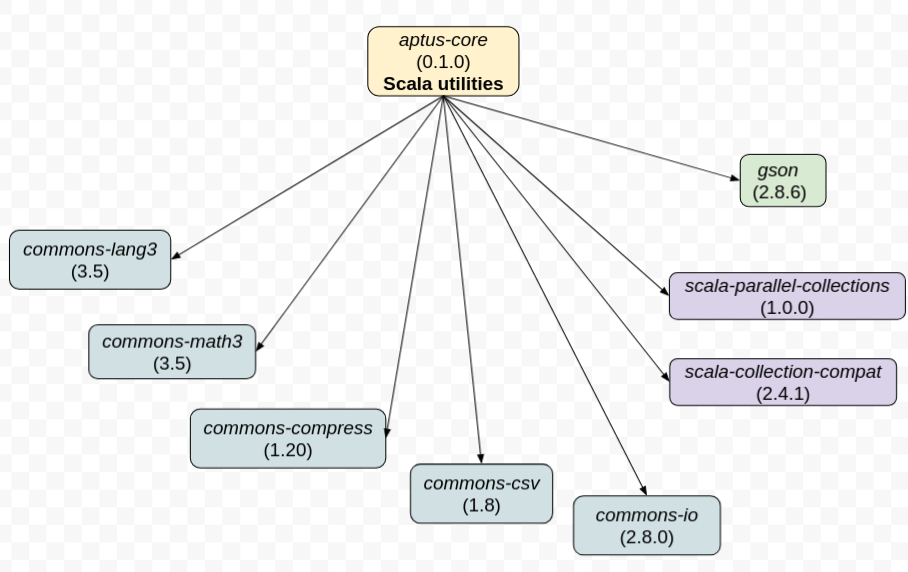

<!-- =========================================================================== -->
# Aptus

"Aptus" is latin for suitable, appropriate, fitting. It is a utility library meant to improve the Scala experience for simple tasks,
when performance isn't most important. It also helps code defensively when representing errors in types isn't important (think `assert`).

<!-- =========================================================================== -->
## SBT
<a name="211006113932"></a>
`libraryDependencies += "io.github.aptusproject" %% "aptus-core" % "0.5.3"`

Then import the following:

```scala
import aptus._ // or more specific imports, eg import.aptus.String_
```

The library is available for Scala
[3.3.1](https://search.maven.org/artifact/io.github.aptusproject/aptus-core_3/0.5.3/jar),
[2.13](https://search.maven.org/artifact/io.github.aptusproject/aptus-core_2.13/0.5.3/jar), and 
[2.12](https://search.maven.org/artifact/io.github.aptusproject/aptus-core_2.12/0.5.3/jar)


<!-- =========================================================================== -->
## Dependency graph
<a name="210121153149"></a>

<div style="text-align:center"></div>


<!-- =========================================================================== -->
## Motivation
<a name="210531095628"></a>

I created Aptus in bits over the years, as I struggled to get seemingly simple tasks done in Scala. It is not intended to be comprehensive, or particularly optimized.
It should be seen more as a starting point for a project, where performance isn't most critical and compute resources aren't too limited.
It can also serve as a reference, from which the basic use of underlying abstractions can be expanded as needed.

I included all the dependencies shown above because I found that they are required for most non-trivial projects.
For instance, what programs nowadays do not need to handle JSON at some point?
Or parse a CSV file? Or handle a bz2 file?

Note that Aptus is heavily used in my data transformation library: [Gallia](https://github.com/galliaproject/gallia-core), as well as most of my other projects (public and private).

### Succinctness
A good example of succinctness is a method like `splitByWholeSeparatorPreserveAllTokens` from Apache Commons's `StringUtils`,
and whose semantics feel [more intuitive](https://github.com/aptusproject/aptus-core/blob/d548ae4/src/test/scala/aptustesting/StringTests.scala#L12-L20) to me than those of Java's `String.split`.
Meanwhile using:

```scala
"foo|bar".splitBy("|")
```

is a lot more convenient than using:

```scala
import org.apache.commons.lang3.StringUtils
val str = "foo|bar"
if (str.isEmpty()) List(str)
else               StringUtils.splitByWholeSeparatorPreserveAllTokens(str, "|").toList
```

It should be noted that both Java's `String.split` and the stdlib's `StringOps.split` have the very unintuitive behavior of not reporting trailing elements when empty, for instance:
```scala
println("1,2,3,,".split(',').toList) // List(1, 2, 3)
```

I try to illustrate such differences in succinctness/consistency/defensiveness of behavior throughout the examples below.

### Practicality
Another aspect of Aptus is practicality, for instance I often find myself using expressions such as:

```scala
"foo=3"
  .splitBy("=")
  .force.tuple2
  .mapSecond(_.toInt)
```

The stdlib's counterpart would look something like:

```scala
"foo=3"
  .split('=')
   match { case Array(x, y: String) =>
     (x, y.toInt) }
```

Which I argue is harder to read/write and less obvious to understand (albeit not a lot more verbose).

<!-- =========================================================================== -->
## Examples
<a name="211006113933"></a>

#### In-line assertions
<a name="211006113934"></a>

```scala
"hello".assert (_.size <= 5)                    .toUpperCase.p // prints "HELLO"
"hello".assert (_.size <= 5, x => s"value=${x}").toUpperCase.p // prints "HELLO"    
"hello".require(_.size <= 5)                    .toUpperCase.p // prints "HELLO"
"hello".require(_.size <= 5, x => s"value=${x}").toUpperCase.p // prints "HELLO"

// these throw AssertionError
"hello".assert (_.size >  5)                    .toUpperCase.p 
"hello".assert (_.size >  5, x => s"value=${x}").toUpperCase.p // "assertion failed: value=hello"
```

<!-- --------------------------------------------------------------------------- -->
Convenient for chaining, consider the pure stdlib alternative:
<a name="211005143255"></a>

```scala
{
  val str = "hello"
  assert(str.startsWith("h"))
  println(str.toUpperCase)
}
```

<!-- =========================================================================== -->
#### In-line printing
<a name="210531093421"></a><a name="printing"></a>

E.g. for quick debugging:
```scala
"hello".prt               // prints: "hello"
"hello".p                 // prints: "hello"
"hello".p.toUpperCase.p   // prints: "hello", then "HELLO"

"hello".inspect(_.size).p // prints: "5", then "hello"
"hello".i      (_.size).p // prints: "5", then "hello"

1.toString.p // prints "1"
1.str     .p // prints "1"

"hello".p__          // prints   "hello"   and exits program (code 0)
"hello".i__(_.quote) // prints "\"hello\"" and exits program (code 0)
```


<!-- =========================================================================== -->
#### String operations
<a name="211006113935"></a>

```scala
"hello". append(" you!")  .p // prints "hello you!"
"hello".prepend("well, ") .p // prints "well, hello"

"hello".colon             .p // prints "hello:"
"hello".tab               .p // prints "hello<TAB>"
"hello".newline           .p // prints "hello<new-line>"

"hello".colon  ("human")  .p // prints "hello:human"
"hello".tab    ("human")  .p // prints "hello<TAB>human"
"hello".newline("human")  .p // prints "hello<new-line>human"

"hello".quote             .p // prints "\"hello\""

"hello|world"  .splitBy("|").p // prints Seq(hello, world)
"hello|world||".splitBy("|").p // prints Seq(hello, world, , ) - won't unexpectely ignore empty trailing elements

"a\tb\tc".splitXsv('\t') // uses commons-csv under the hood to properly handle the split (eg escaping, ...)

"hello".padLeft (8, ' ').p // "   hello"
"hello".padRight(8, ' ').p // "hello   "
1.str  .padLeft (3, '0').p // "001"
1.str  .padRight(3, '0').p // "100"

"mykey".   contains("my").p // stdlib
"mykey".notContains("MY").p // negative counterpart

// .. many more, see String_, for instance:
// - strip{Prefix,Suffix}{Guaranteed,IfApplicable}
// - remove{Guaranteed,IfApplicable}
// - toBase64
// ...
```

Note: see corresponding [tests](https://github.com/aptusproject/aptus-core/blob/d548ae4/src/test/scala/aptustesting/StringTests.scala#L12-L20)

<!-- =========================================================================== -->
#### Number operations
<a name="211006113916"></a>

```scala
3.1416.add       (1).p // 4.1416
3.1416.multiplyBy(2).p // 6.2832
...
3.1416.isInBetween(fromInclusive = 3.0, toExclusive: 4.0).p // true
// likewise for Int and Long
```

For `Double`:
```
3.1416     .formatDecimals(2).p // 3.14
3.1416.exp .formatDecimals(4).p // 23.1409
3.1416.log2.formatDecimals(4).p // 1.6515
```

Personally, I always have to look up printf's "% notation" before using it, so a method like `formatDecimals` make things a lot easier.

Aptus also helps with collections of numbers:
```scala
Seq(3, 2, 1).mean  .p // 2.0
Seq(3, 2, 1).minMax.p // (1, 3)
// ... more: median, stdev, range, IQR, ... (see aptus.Seq_)
```

<!-- =========================================================================== -->
#### Time operations
<a name="211006113906"></a>

```scala
"2023-06-05".parseLocalDate.getYear.p // 2023

// also available:
//   parseLocalDateTime, parseLocalTime, parseInstant, parseOffsetDateTime and parseZonedDateTime
// and
//   parseLocalDateTime(pattern), ...
```

<!-- =========================================================================== -->
#### Conditional piping (a.k.a conditional "thrush")
<a name="210531093424"></a><a name="conditional-piping"></a>

```scala
"hello"  .pipeIf(_.size <= 5)(_.toUpperCase).p // prints "HELLO"
"bonjour".pipeIf(_.size <= 5)(_.toUpperCase).p // prints unchanged

3.pipeIf(_ % 2 == 0)(_ + 1).p // prints 3 (unchanged)
4.pipeIf(_ % 2 == 0)(_ + 1).p // prints 5

val suffixOpt = Some("?")
"hello".pipeOpt(suffixOpt)(suffix => _ + suffix).p // prints "hello?"
"hello".pipeOpt(None)     (suffix => _ + suffix).p // prints unchanged
```

See [discussion](https://users.scala-lang.org/t/implicit-class-for-any-and-or-generic-type/501) on _Scala Users_.

There also is also a `mapIf` counterpart:

```scala
Seq(1, 2, 3).mapIf(true) (_ + 1).p // List(2, 3, 4)
Seq(1, 2, 3).mapIf(_ < 2)(_ + 1).p // List(2, 2, 3)
```

<!-- =========================================================================== -->
#### In-line "to Option"
<a name="210531093425"></a><a name="in-line-to-option"></a>

```scala
"hello"  .in.someIf(_.size <= 5).p // prints Some("hello")
"bonjour".in.someIf(_.size <= 5).p // prints None

"hello"  .in.noneIf(_.size <= 5).p // prints None
"bonjour".in.noneIf(_.size <= 5).p // prints Some("bonjour")

// note: can also use shorthands: inNoneIf/inSomeIf
```

<!-- --------------------------------------------------------------------------- -->
<a name="211006141307"></a>
Convenient for chaining, consider the pure stdlib alternative:
```scala
{
  val str = "hello"
  val opt = if (str.size <= 5) Some(str) else None
  println(opt)
}
```

Notes:
- `Option.when` could also be used, but the test part isn't a predicate on the element (which would be much better).
- Someone on the scala user list also pointed out this alternative: `Some("hello").filter(_.size <= 5)`. While clever, I'd argue the semantics are much less obvious than `"hello".in.someIf(_.size <= 5)`.

<!-- =========================================================================== -->
#### "force" disambiguator (Option/Map)
<a name="210531093426"></a><a name="force-disambiguator"></a>

`.get` is polysemic in the standard library, sometimes "attempting" to get the result as with `Map` (returns `Option[T]`), sometimes "forcing" it as with `Option` (returns `T`)
   
aptus' `.force` conveys semantics unambiguously:

```scala
val myOpt = Some("foo")
val myMap = Map("bar" -> "foo")

myOpt.force       .p // prints "foo"
myMap.force("bar").p // prints "foo"

// versus stdlib way:
myOpt.get       .p // prints      "foo"  -> forcing 
myMap.get("bar").p // prints Some("foo") -> attempting
```


<!-- =========================================================================== -->
### More forcing
<a name="210610085515"></a><a name="forcing"></a><a name="force-tuples"></a>

```scala
Seq(1)      .force.one     .p // 1
Seq(1)      .force.option  .p // Some(1)
Seq( )      .force.option  .p // None
Seq(1, 2, 3).force.distinct.p // Seq(1, 2, 3)
Seq(1, 2, 3).force.set     .p // Set(1, 2, 3)

val (first, second)        = Seq("foo", "bar")       .force.tuple2
val (first, second, third) = Seq("foo", "bar", "baz").force.tuple3
// ... and so on up to 10
```

<!-- --------------------------------------------------------------------------- -->
But:
<a name="211006113936"></a>

```scala
Seq(1, 2)   .force.one      // error
Seq(1, 2)   .force.option   // error
Seq(1, 2, 1).force.distinct // error
Seq(1, 2, 1).force.set      // error
Seq(1, 2, 3).force.tuple2   // error
... and so on
```

The `.force.one` mechanism is one of the most useful operations, and a much safer bet than simply doing `.head`.

<!-- =========================================================================== -->
### Help with Options
<a name="211006113937"></a>

To optional:
<a name="211005135653"></a><a name="to-optional"></a>
```scala
   (None   , Some(2))         .toOptionalTuple.p // None
   (Some(1), None   )         .toOptionalTuple.p // None   
   (Some(1), Some(2))         .toOptionalTuple.p // Some((1, 2))

Seq(None,    None,    None)   .toOptionalSeq  .p // None
Seq(Some(1), Some(2), None)   .toOptionalSeq  .p // None
Seq(Some(1), Some(2), Some(3)).toOptionalSeq  .p // Some(Seq(1, 2, 3))
```

<!-- --------------------------------------------------------------------------- -->
Swapping:
<a name="211005135654"></a><a name="option-swapping"></a>

```scala
// parameter for .swap is by-name
Some("foo").swap("bar").p // None
None       .swap("bar").p // Some("bar")
```


<!-- =========================================================================== -->
### Help with Sequences

<a name="211005132123"></a><a name="formatting-sequences"></a>
Quick sequence formatting:
```scala
Seq(1, 2, 3). @@.p //    [1, 2, 3]
Seq(1, 2, 3).#@@.p // #3:[1, 2, 3]

Seq(1, 2, 3).joinln   // one per line
Seq(1, 2, 3).joinlnln // one per line every other line

Seq(1, 2, 3).joinln.sectionAllOff("data:") // or equivalently below
Seq(1, 2, 3).section             ("data:") // returns:
/*
  data:
      1
      2
      3
*/
```

Aptus also provides help with sorting for common cases, for instance:

```scala
Seq(
    Seq("d", "e", "f"),
    Seq("g", "h", "i"),
    Seq("a", "b", "c"))
  .sorted(aptus.seqOrdering[String])
/*
returns:

Seq(
    Seq("a", "b", "c"),
    Seq("d", "e", "f"),
    Seq("g", "h", "i") )))
*/
```

<!-- --------------------------------------------------------------------------- -->
### Zip operations
<a name="211005132124"></a><a name="zip-same-size"><a name="zip"></a>
Most of the time, we want to zip collections of same size, and we want to code it defensively:
```scala
Seq(1, 2, 3).zipSameSize(Seq(4, 5, 6)).p // Seq((1,4), (2,5), (3,6))
Seq(1, 2, 3).zipSameSize(Seq(4, 5))   .p // error
```

Ask yourselves: what are legitimate use cases where we zip two collections of different size and are perfectly happy to have the longuest silently truncated?

Other useful `zip`-related operations are:

```scala
Seq("a", "b", "c").zipWithIsFirst.map { case (x, first) => if (first) ... else ... }
Seq("a", "b", "c").zipWithIsLast .map { case (x, last ) => if (last)  ... else ... }

Seq("a", "b", "c").zipWithIndex.p // List((a,0), (b,1), (c,2))
Seq("a", "b", "c").zipWithRank .p // List((a,1), (b,2), (c,3))
```

<!-- --------------------------------------------------------------------------- -->
Splitting at head/last:
<a name="211005135654"></a><a name="split-at-head-last"></a>

```scala
Seq(1, 2, 3).splitAtHead.p // (1,Seq(2, 3))
Seq(1, 2, 3).splitAtLast.p // (Seq(1, 2),3)
```

<!-- --------------------------------------------------------------------------- -->
Contained:
<a name="211005132125"></a><a name="contained"></a>
```scala
1.   containedIn(Seq(1, 2, 3)).p // true
1.notContainedIn(Seq(1, 2, 3)).p // false 
// also available for Set
```

_Note: Why not use "contains" from the stdlib instead? Consider the following situation:_
```scala
val ref = Seq("2", "4", "6")
Seq(1, 2, 3).map(ref.contains(_.toString))      // cannot do that
Seq(1, 2, 3).map(x => ref.contains(x.toString)) // we need an intermediate
Seq(1, 2, 3).map(_.toString.containedIn(ref))   // unless using containedIn
```

<!-- --------------------------------------------------------------------------- -->
<a name="211005132126"></a><a name="seq-ordering"></a>
Ordering sequences of sequences (size prevails):
```scala
implicit val ord: Ordering[Seq[Int]] = aptus.seqOrdering
Seq(Seq(4, 5, 6), Seq(1, 2, 3)).sorted.p // Seq(Seq(1, 2, 3), Seq(4, 5, 6))
Seq(Seq(4, 5, 6), Seq(1, 2   )).sorted.p // Seq(Seq(1, 2)   , Seq(4, 5, 6))
Seq(Seq(4, 5)   , Seq(1, 2, 3)).sorted.p // Seq(Seq(4, 5)   , Seq(1, 2, 3))
```

<!-- --------------------------------------------------------------------------- -->
Note: `List` vs `Seq`, see [discussion](https://users.scala-lang.org/t/seq-vs-list-which-should-i-choose/5412) on _Scala Users_.


<!-- =========================================================================== -->
### Help with Maps
<a name="211006113938"></a>

Most of the time, we do not want duplicates to be silently discarded: 
```scala
// is this what we wanted?
Seq(1 -> "a", 2 -> "b", 2 -> "c").toMap    .p // Map(1 -> "a", 2 -> "c")

// likely not
Seq(1 -> "a", 2 -> "b", 2 -> "c").force.map.p // error
Seq(1 -> "a", 2 -> "b")          .force.map.p // Map(1 -> "a", 2 -> "b")
```

<!-- --------------------------------------------------------------------------- -->
Associate left/right:
<a name="211005135616"></a><a name="associate-side"></a>

```scala
Seq("foo", "bar").map(_.associateLeft(_.toUpperCase)).force.map.p
  // returns: Map("FOO" -> "foo", "BAR" -> "bar")

Seq("foo", "bar").map(_.associateRight(_.size)).force.map.p
  // returns: Map("foo" -> 3, "bar" -> 3)
```

<!-- --------------------------------------------------------------------------- -->
Group by key:
<a name="221004113246"></a><a name="group-by-key"></a>

```scala
Seq("foo" -> 1, "bar" -> 2, "foo" -> 3).groupByKey.p
  // returns: Map(bar -> List(2), foo -> List(1, 3))
  
// if original order must be preserved:
Seq("bar" -> 2, "foo" -> 1, "foo" -> 3).groupByKeyWithListMap.p
  // returns: ListMap(bar -> List(2), foo -> List(1, 3))
```


<!-- --------------------------------------------------------------------------- -->
Count by key:
<a name="221004113247"></a><a name="count-by-key"></a>

```scala
Seq("foo" -> 1, "bar" -> 2, "foo" -> 3).countByKey.p
  // returns: List((2,foo), (1,bar))
```

<!-- --------------------------------------------------------------------------- -->
Count by self:
<a name="221004113237"></a><a name="count-by-self"></a>

```scala
Seq("a", "b", "a", "c").countBySelf.p
  // returns: Seq(("a", 2), ("b", 1), ("c", 1)))
  // note: ordered by DESC
```

<!-- =========================================================================== -->
### Help with Tuples
<a name="211006113939"></a>

```scala
(1, 2).toSeq.p // Seq(1, 2)

(1, 2).mapFirst (_ + 1) // (2, 2)
(1, 2).mapSecond(_ + 1) // (1, 3)

(1, 2, 3).mapThird(_ + 1) // (1, 2, 4)
```


<!-- =========================================================================== -->
### Wrapping
<a name="211006113940"></a>

```scala
"foo".in.some .p // Some("foo")
"foo".in.seq  .p // Seq ("foo")
"foo".in.list .p // List("foo")
"foo".in.left .p // Left("foo")
"foo".in.right.p // Right("foo")
// also see in.someIf/in.noneIf above
```


<!-- =========================================================================== -->
### Sliding pairs
<a name="211006113941"></a>

```scala
Seq[Int]()             .slidingPairs // Seq()
Seq     (1)            .slidingPairs // Seq()
Seq     (1, 2, 3, 4, 5).slidingPairs // Seq((1, 2), (2, 3), (3, 4), (4, 5))

Seq(1, 2, 3).slidingPairsWithPrevious.p // List((None,1), (Some(1),2), (Some(2),3))
Seq(1, 2, 3).slidingPairsWithNext    .p // List((1,Some(2)), (2,Some(3)), (3,None))
```

<!-- --------------------------------------------------------------------------- -->
<a name="211006141244"></a>
consider the pure stdlib alternative:

```scala
Seq(1, 2, 3, 4, 5)
  .sliding(2)
  .map { x =>
    assert(x.size == 2)
    (x(0), x(1)) }
  .toSeq
```


<!-- =========================================================================== -->
### Closing resources
<a name="211005133508"></a><a name="closeabled"></a>

Aptus' `Closeabled` boils down to:

  `  class Closeabled[T](underlying: T, cls: Closeable) extends Closeable`

Convenient for instance when you don't want to manage pairs of `Iterator/Closeable`, e.g.:

```scala
// let's write lines
Seq("hello", "world").writeFileLines("/tmp/lines")

// and stream them back
val myCloseabled: Closeabled[Iterator[String]] =
"/tmp/lines"
  .streamFileLines()
  .pipe(Closeabled.fromPair) // see scala.util.chaining for .pipe

// for instance, we can consume the content (will automatically close)
myCloseabled                   .consume(_.toList).p // as is
<XOR>
myCloseabled.map(_.map(_.size)).consume(_.toList).p // line pre-processing
```


<!-- =========================================================================== -->
### Orphan methods
<a name="211006113942"></a>

We call some method directly from the `aptus` package object if no natural parent can be used.

```scala
aptus.fs.homeDirectoryPath().p // "/home/tony"
aptus.hardware.totalMemory().p // 1011351552
aptus.random.uuidString()   .p // a1bffc1e-72aa-477e-ac84-e4133ffcafad
aptus.time.stamp().p           // 240224152753

aptus.illegalState   ("freeze!") // Exception in thread "main" IllegalStateException: freeze!
aptus.illegalArgument("freeze!") // Exception in thread "main" IllegalArgumentException: freeze!

aptus.reflect.formatStackTrace().p // returns:
/*
  java.lang.Throwable
      at aptus.aptmisc.Reflect$.formatStackTrace(Misc.scala:62)
      ...
      <where you are in your code>
*/

// ... (see more in aptus.AptusAliases)
```

<!-- =========================================================================== -->
### Conveying intent
<a name="211006113943"></a>

These are often used to save/homogenize comments.

<!-- --------------------------------------------------------------------------- -->
Sometimes we want to convey that a sequence cannot be reordered without consequences, think of it as built-in comment
```
@ordermatters val mySeq(MostImportant, SecondMostImportant, ...)
```

An annotation is favored over a type alias here so that it can be applied to other code areas than sequences.

<!-- --------------------------------------------------------------------------- -->
The following are just aliases, cheap replacements for `NonEmptyList`-like alternatives:
```scala
val      values: Nes[Int] =      Seq(1, 2, 3)
val maybeValues: Pes[Int] = Some(Seq(1, 2, 3))
```

Note: Value classes don't accept `require` statements


<!-- =========================================================================== -->
### IO
<a name="210531093427"></a><a name="files-handling"></a>

Plain files:
```scala
"hello world".writeFileContent("/tmp/content")
"/tmp/content".readFileContent().p // prints: "hello world"

Seq("hello", "world").writeFileLines("/tmp/lines")
"/tmp/lines".readFileLines().p // prints: Seq("hello", "world")
```

<!-- --------------------------------------------------------------------------- -->
Compressed files:
<a name="211006113445"></a><a name="compression"></a>

```scala
"hello world".writeFileContent("/tmp/content.gz")
"/tmp/content.gz".readFileContent().p // prints: "hello world" 

Seq("hello", "world").writeFileLines("/tmp/lines.gz")
"/tmp/lines.gz".readFileLines().p // prints: Seq("hello", "world")

// note: file -i /tmp/content.gz" shows it's indeed application/gzip

"/data/bigfile.gz".streamFileLines() // returns a SelfClosingIterator[String], which closes itself once all lines have been seen
```

<!-- --------------------------------------------------------------------------- -->
JSON:
<a name="211006113436"></a><a name="json"></a>

A special note about JSON, owing to its ubiquity (and despite its [many flaws](https://github.com/galliaproject/gallia-docs/blob/master/json.md)).
While [Gallia](https://github.com/galliaproject/gallia-core) is my main project pertaining to data in general (especially transformation thereof), I included a minimal set of functionality in Aptus:

```scala
""" {"foo": 1} """.jsonObject // returns a com.google.gson.JsonObject
"""[{"foo": 1}]""".jsonArray  // returns a com.google.gson.JsonArray

"""{"foo": 1, "bar": true}""".prettyJson.p // .compactJson is also available
/*
{
  "foo": 1,
  "bar": true
}
*/
```

In the future, a subset of Gallia will be created, 
which will basically offer a similar set of operations 
but without any concern for the underlying schema: 
[gallia-dyn](https://github.com/galliaproject/gallia-dyn).
It will offer a convenient way to perform "dynamic" transformations, 
and therefore handle JSON. Once ready, 
a subset of gallia-dyn` will likely be included in Aptus for convenience, 
so that simple manipulations such as these will be possible OOTB:

```scala
"""{"foo": "hello", "bar": 2, "baz": true}"""
  .readObj
    .toUpperCase("foo")
    .increment  ("bar")
    .drop       ("baz")
  .printCompactJson()
  // """{"foo": "HELLO", "bar": 3}"""
```

<!-- --------------------------------------------------------------------------- -->
URLs:
<a name="211006113446"></a><a name="urls"></a>

```scala
val TestResources =
  "https://raw.githubusercontent.com/aptusproject/aptus-core/6f4acbc/src/test/resources"

s"${TestResources}/content".readUrlContent() // prints "hello word"
s"${TestResources}/lines"  .readUrlLines().p // prints: Seq("hello", "world")
```

Notes:
- These may move under `"...".file` and `"...".url` respectively (TBD)
- In the future we'll allow a basic POST as well

<!-- =========================================================================== -->
### File System
<a name="210531093417"></a><a name="file-system"></a>

A very lightweight way to handle the file system, not mean to be comprehensive (use [`os-lib`](https://github.com/com-lihaoyi/os-lib) for more power)
```scala
"/tmp/sbt".path.isDir()
"/tmp/sbt".path.file.removeFile()
...

"/tmp/sbt".path.dir.listNames()
...
"/tmp/sbt".path.dir.listFilePathsRecursively()
```

<!-- =========================================================================== -->
### System calls
<a name="210601115320"></a><a name="system-calls"></a>

Quick-and-dirty system calls:

```scala
"echo hello"           .systemCall() // prints: "hello"
"date +%s"             .systemCall() // prints: "1622562984"
"head -1 /proc/cpuinfo".systemCall() // prints: "processor: 0"
```

<!-- =========================================================================== -->
## Backlog
<a name="210531093429"></a>
- At least a `List_` counterpart to `Seq_`, maybe via code generation (again see [discussion](https://users.scala-lang.org/t/seq-vs-list-which-should-i-choose/5412) on _Scala Users_)
- Add more useful abstractions borrowed from other languages, e.g. Python's [`Counter`](https://github.com/anthony-cros/data-science-from-scratch-scala/blob/7ed4a38/src/main/scala/scratchscala/utils/Counter.scala)
- Lots more tests to be written, though many methods in aptus are too trivial to warrant a test, e.g. `def pipeIf(test: Boolean)(f: A => A): A = if (test) f(a) else a`
- More useful methods remain to be ported from Aptus' prototype (not published because too messy)
- See all the `TODO`s in the code
- Also see Gallia's [backlog](https://github.com/galliaproject/gallia-docs/blob/master/tasks.md#aptus)

<!-- =========================================================================== -->
## Contributing
<a name="210531093430"></a>

Contributions welcome.


<!-- =========================================================================== -->
