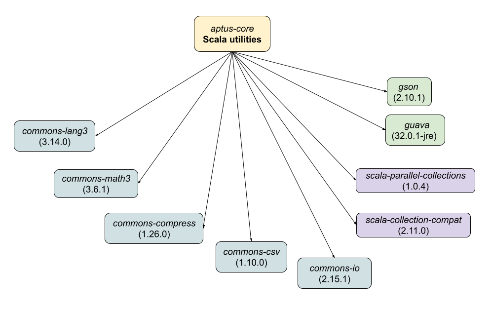

# Aptus

"Aptus" is latin for suitable, appropriate, fitting. It is a utility library to help smooth certain pain points of the Java/Scala ecosystem.

It is currenly used as part of [Gallia](https://github.com/galliaproject/gallia-core/blob/master/README.md#210129170214), a Scala library for data manipulation.

## SBT
`libraryDependencies += "io.github.aptusproject" %% "aptus-core" % "0.2.0"`

Then import the following:

```scala
import aptus._ // or more specific imports, eg import.aptus.String_
```

The library is available for Scala 3.0, 2.13 and 2.12

<a name="210121153149"></a>
**aptus-core** dependency graph:<br/><br/>
<div style="text-align:center"></div>

<a name="210531095628"></a>
A big motivation for including all these dependencies is that I find myself constantly adding them to my projects, in order to get things done.
A great example of this being a method like `splitByWholeSeparatorPreserveAllTokens` (from `org.apache.commons.lang3.StringUtils`)
whose semantics feel [more intuitive](https://github.com/aptusproject/aptus-core/blob/d548ae4/src/test/scala/aptustesting/StringTests.scala#L12-L20) to me than those of `java.lang.String.split`. Meanwhile using:

```scala
"foo|bar".splitBy("|")
```

is more convenient than:

```scala
import org.apache.commons.lang3.StringUtils
val str = "foo|bar"
if (str.isEmpty()) List(str)
else               StringUtils.splitByWholeSeparatorPreserveAllTokens(str, "|").toList
```

## Examples

#### In-line printing
<a name="210531093421"></a><a name="printing"></a>
```scala
"hello".p               // prints: "hello"
"hello".p.toUpperCase.p // prints: "hello", then "HELLO"

3.str     .p // prints "3"
3.toString.p // prints "3"
```
Convenient for quick debugging

#### In-line assertions
<a name="210531093422"></a><a name="in-line-assertions"></a>
```scala
  "hello".assert (_.startsWith("h"))                    .toUpperCase.p // prints "HELLO"
  "hello".assert (_.startsWith("h"), x => s"value=${x}").toUpperCase.p // prints "HELLO"    
  "hello".require(_.startsWith("h"))                    .toUpperCase.p // prints "HELLO"   
//"hello".assert (_.startsWith("H"))                    .toUpperCase.p // throws AssertionError
//"hello".assert (_.startsWith("H"), x => s"value=${x}").toUpperCase.p // throws AssertionError:
                                                                // assertion failed: value=hello
```
Convenient for chaining, consider the alternative:
```scala
{
  val str = "hello"
  assert(str.startsWith("h"))
  str.toUpperCase.p
}
```

#### String operations
<a name="210531093423"></a><a name="string-ops"></a>
```scala
"hello". append(" you!")  .p // prints "hello you!"
"hello".prepend("well, ") .p // prints "well, hello"
"hello".colon             .p // prints "hello:"
"hello".colon  ("human")  .p // prints "hello:human"
"hello".tab    ("human")  .p // prints "hello<TAB>human"
"hello".newline("human")  .p // prints "hello<new-line>human"
"hello".quote             .p // prints "\"hello\""
"hello|world".splitBy("|").p // prints List(hello, world)
// .. many more, see String_
```

Note: see corresponding [tests](https://github.com/aptusproject/aptus-core/blob/d548ae4/src/test/scala/aptustesting/StringTests.scala#L12-L20)

#### Conditional piping (a.k.a thrush)
<a name="210531093424"></a><a name="conditional-piping"></a>
```scala
"bonjour".pipeIf(_.startsWith("h"))(_.toUpperCase).p // prints "bonjour" (unchanged)
"hello"  .pipeIf(_.startsWith("h"))(_.toUpperCase).p // prints "HELLO"

3.pipeIf(_ % 2 == 0)(_ + 1).p // prints 3 (unchanged)
4.pipeIf(_ % 2 == 0)(_ + 1).p // prints 5

val suffixOpt = Some("?")
"hello".pipeOpt(suffixOpt)(suffix => _ + suffix).p // prints "hello?"
"hello".pipeOpt(None)     (suffix => _ + suffix).p // prints "hello" (unchanged)
```

See [discussion](https://users.scala-lang.org/t/implicit-class-for-any-and-or-generic-type/501) on _Scala Users_.

#### In-line "to Option"
<a name="210531093425"></a><a name="in-line-to-option"></a>
```scala
"hello"  .in.noneIf(_.size >  5).p // prints Some("hello")
"bonjour".in.noneIf(_.size >  5).p // prints None

"hello"  .in.someIf(_.size <= 5).p // prints Some("hello")
"bonjour".in.someIf(_.size <= 5).p // prints None

// notes:
// - formerly '.as' instead of '.in'
// - can also use shorthands: inNoneIf/inSomeIf
```
    
Convenient for chaining, consider the alternative:
```scala
{
  val str = "hello"
  val opt =
    if ("hello".size > 5) None
    else                  Some(str)
  opt.p
}
```

#### Associate left/right

```scala
Seq("foo", "bar").map(_.associateLeft(_.toUpperCase)).toMap.p
  // returns: Map("FOO" -> "foo", "BAR" -> "bar")

Seq("foo", "bar").map(_.associateRight(_.size)).toMap.p
  // returns: Map("foo" -> 3, "bar" -> 3)
```

#### "force" disambiguator (Option/Map)
<a name="210531093426"></a><a name="force-disambiguator"></a>

`.get` is polysemic in the standard library, sometimes "attempting" to get the result as with `Map` (returns `Option[T]`), sometimes "forcing" it as with `Option` (returns `T`)
   
aptus' `.force` better conveys semantics unambiguously:

```scala
val myOpt = Some("foo")
val myMap = Map("bar" -> "foo")

myOpt.get         .p // prints "foo" -> stdlib way, forcing 
myOpt.force       .p // prints "foo"
myMap.get  ("bar").p // prints Some("foo") -> stdlib way, attempting
myMap.force("bar").p // prints "foo"
```

### System calls
<a name="210601115320"></a><a name="system-calls"></a>

Quick-and-dirty system calls:

```scala
"echo hello"           .systemCall() // prints: "hello<new-line>"
"date +%s"             .systemCall() // prints: "1622562984
"head -1 /proc/cpuinfo".systemCall() // prints: "processor	: 0<new-line>"
```

### Handling files/URLs
<a name="210531093427"></a><a name="files-handling"></a>

Plain files:
```scala
"hello world".writeFileContent("/tmp/content")
"/tmp/content".readFileContent().p // prints: "hello world"

Seq("hello", "world").writeFileLines("/tmp/lines")
"/tmp/lines".readFileLines().p // prints: Seq("hello", "world")
```

Compression:

```scala
// ---------------------------------------------------------------------------
"hello world".writeFileContent("/tmp/content.gz")
"/tmp/content.gz".readFileContent().p // prints: "hello world"	  

Seq("hello", "world").writeFileLines("/tmp/lines.gz")
"/tmp/lines.gz".readFileLines().p // prints: Seq("hello", "world")

// note:
"file -i /tmp/content.gz".systemCall.p // prints "/tmp/content.gz: application/gzip; [...]"
```

for URLs:

```scala
val TestResources =
  "https://raw.githubusercontent.com/aptusproject/aptus-core/6f4acbc/src/test/resources"

s"${TestResources}/content".readUrlContent() // prints "hello word"
s"${TestResources}/lines"  .readUrlLines().p // prints: Seq("hello", "world")
```

Note: in the future we'll allow a basic POST as well

### WIP
<a name="210531093428"></a>
(lots more to port here)

## Backlog

See Gallia's [backlog](https://github.com/galliaproject/gallia-docs/blob/master/tasks.md#aptus) for now.

## Contributing

Contributions welcome.

